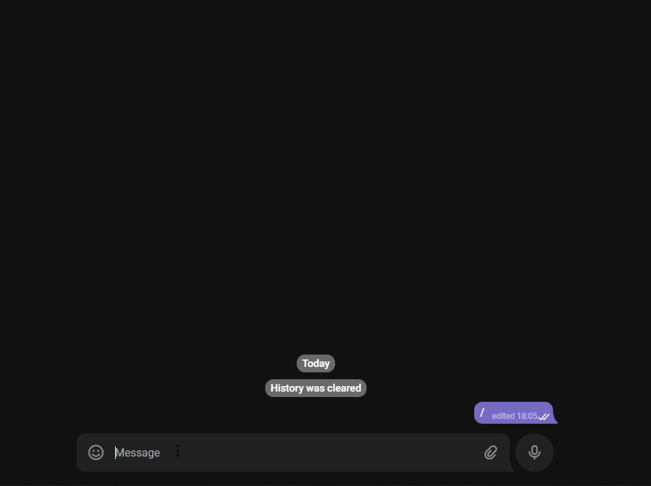
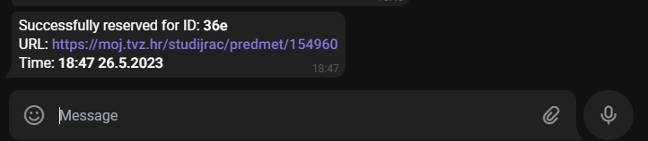
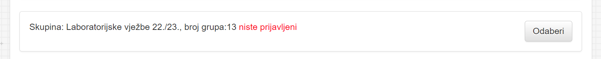
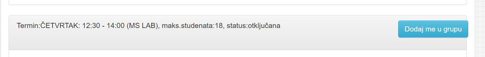

# Rezervator bot za moj.tvz.hr

Bot za rezervaciju termina na moj.tvz.hr

> Projekt je neovisan i ne asocira se s [TVZ-om](https://tvz.hr)

<!-- gif -->
<p align="center">
  </img>
</p>

<p align="center"> <i>Primjer korištenja bota</i> </p>

Sve što botu treba su informacije o terminu i on će obaviti prijavu. Bot korisiti [Telegram](https://telegram.org/) za komunikaciju. Nakon uspješne rezervacije bot će poslati poruku

<p align="center">
  </img>
</p>

## Instalacija

> Potrebo je samostalno hostati bota jer botu trebaju senzitvne informacije poput lozinke i emaila

Potrebni alati:

- Node.js v16+
- npm/yarn/pnpm

```bash
pnpm -g i tvz-rezervator-bot # ili
npm -g i tvz-rezervator-bot # ili
yarn global add tvz-rezervator-bot
```

### Kreiranje Telegram bota

[Tutorial za kreiranje bota](https://sendpulse.com/knowledge-base/chatbot/telegram/create-telegram-chatbot)

### Env varijable

Lista varijabla koje su potrebne za rad bota:

- `TVZ_EMAIL` - `@tvz.hr` email
- `TVZ_PASSWORD` - lozinka
- `TG_SECRET` - secret koji se dobije kreacijom bota

> Varijable `TVZ_EMAIL` i `TVZ_PASSWORD` jedno se koriste za login na [moj.tvz.hr](), spremljene su na disk, [te enkriptirane (u svrhu pomućivanja)](https://github.com/sindresorhus/conf#encryptionkey)

Postavljanje varijabla

```bash
rez-bot set TVZ_EMAIL iprezime@tvz.hr
rez-bot set TVZ_PASSWORD moj_pass
rez-bot set TG_SECRET ovo_je_ta_tajna
```

## Pokretanje

```bash
rez-bot
```

Nakon pokretanja bot je spreman za [korištenje](#korištenje). U slučaju greške pri radu, bot će se automatski restartati

## Korištenje

Najprije treba "zaključati" bota

```bash
/lock
```

### Dodavanje rezervacije

Bot će sam pronaći sve termine i skupine

```bash
/schedule <link> # alias s
```

Ili

```bash
/schedule <link> <text skupine> <text termina> <vrijeme>
```

#### Primjer

```bash
/schedule https://moj.tvz.hr/studijrac/predmet/123456 "​2​2./​2​3." "SRIJEDA 10:00" 17:35-7.2.2023
```

> **Warning**
> Tekst u zagradama mora odgovarati tekstu na stranici!

#### Kako odabrati dobar `<text skupine>` i `<text termina>`

Bilo bi dobro da odabrani tekst ne sadrži promjenjive informacije poput broja grupa ili maks. broja studenata



Za danu skupinu primjer dobrog `<text skupine>` je `Laboratorijske vježbe 22./23.`



Za dan termin primjer dobrog `<text termina>` je `ČETVRTAK: 12:30 - 14:00 (MS LAB)`

### Brisanje rezervacije

```bash
/delete <id> # alias /d
```

Za brisanje svih

```bash
/delete *
```

### Lisanje rezervacija

```bash
/list # alias /ls
```

## Bilo bi dobro imati

- Rezervacije na LMS-u ([lms-2020.tvz.hr](https://lms-2020.tvz.hr))
